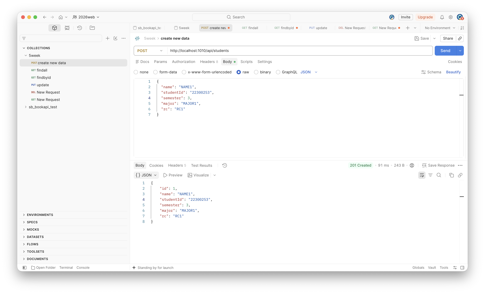
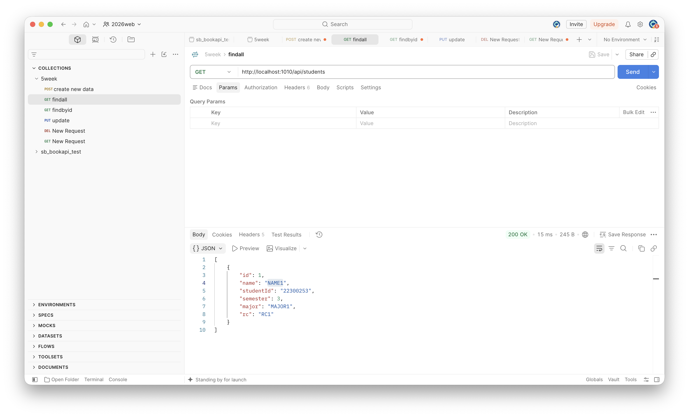
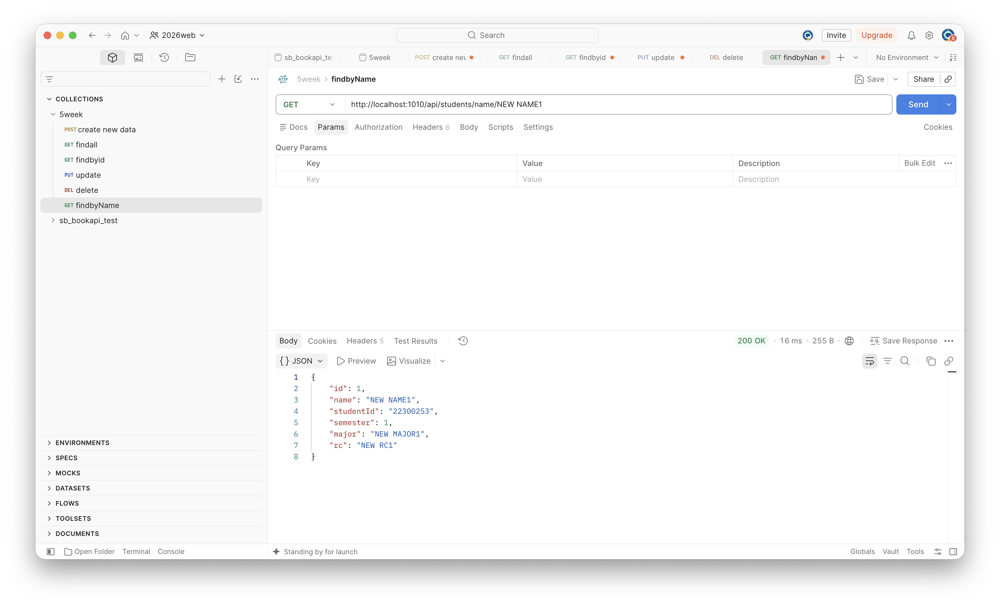
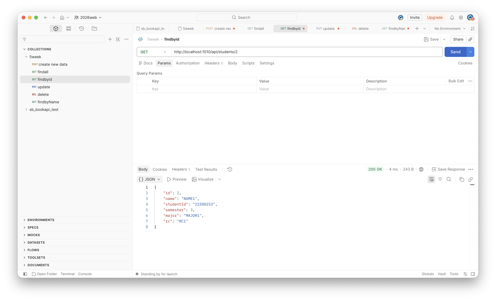
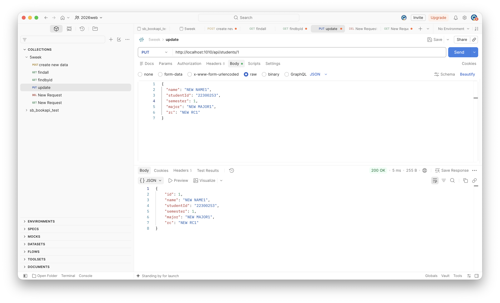
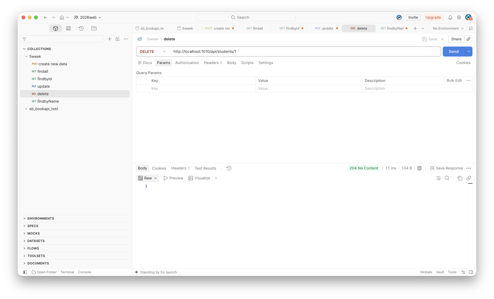

## 실행 결과













# Student Management REST API

## ① 프로젝트 소개

학생 정보를 관리하는 Spring Boot REST CRUD API이다.

관리 데이터: `id`, `studentId`, `name`, `semester`, `major`, `rc`, `id`는

### 프로젝트 구조

```text
controller
 └─ StudentController
service
 └─ StudentService
repository
 ├─ StudentRepository
 └─ MemoryStudentRepository
domain
 └─ Student
dto
 ├─ RequestStudent
 └─ ResponseStudent
```

### 로컬 실행 방법

IntelliJ에서 프로젝트를 실행한 후
http://localhost:1010/api/students 주소로 브라우저 이동

### API Endpoint

| Method | URL | 기능 |
| --- | --- | --- |
| POST | `/api/students` | 학생 등록 |
| GET | `/api/students` | 전체 조회 |
| GET | `/api/students/{id}` | 단건 조회 |
| PUT | `/api/students/{id}` | 수정 |
| DELETE | `/api/students/{id}` | 삭제 |
| GET | `/api/students/name/{name}` | 이름 검색 |

### 요청 JSON 예시

```json
{
  "studentId": "22300253",
  "name": "홍길동",
  "semester": 5,
  "major": "AI",
  "rc": "Kuyper"
}
```

### 응답 JSON 예시

```json
{
  "id": 1,
  "studentId": "22300253",
  "name": "홍길동",
  "semester": 5,
  "major": "AI",
  "rc": "Kuyper"
}
```

### URL

- Organization Repository: `[입력]`
- Personal Repository: `[입력]`
- 배포 URL: `[입력]`


## ② 개발환경 및 Dependency

| 항목 | 내용 |
| --- | --- |
| IDE | IntelliJ IDEA |
| JDK | Java 21 |
| Spring Boot | `[버전 입력]` |
| Build Tool | Gradle `[버전 입력]` |
| 데이터 저장 | LinkedHashMap |
| API Test | Postman |
| 배포 | Docker + `[배포 환경]` |

### Dependency

**Spring Web**

REST API를 구현하기 위해 사용하였다.  
`@RestController`, `@GetMapping`, `@PostMapping`, `@RequestBody`, `@PathVariable` 등을 이용하여 HTTP 요청을 처리하였다.


## ③ Solution 분석

## Solution 분석

### 1. Controller → Service → Repository → Memory의 요청 처리 흐름

> Controller

@RestController는 @Controller와 @ResponseBody의 기능이 합쳐진 것으로,
Spring Boot에게 해당 클래스가 Controller임을 알려주고 반환한 객체를 JSON 형식으로 변환하여 Client에게 전달한다.

@RequestMapping을 통해 Controller에서 공통으로 사용하는 URL을 지정할 수 있다.

Client가 JSON 데이터를 전송하면 Controller의 @RequestBody가 JSON 데이터를 Request DTO 객체로 변환한다.
Controller는 변환된 Request DTO를 Service의 메서드에 전달한다.

Service에서 처리가 끝난 후 Response DTO가 반환되면,
@RestController에 의해 JSON 형식으로 변환되어 Client에게 전달된다.


> Service

Controller에 의해 호출된 Service는 실제 데이터 처리와 비즈니스 로직을 수행한다.

Request DTO로 전달받은 데이터를 Domain 객체로 변환하고,
데이터 저장이나 조회가 필요한 경우 Repository를 호출한다.

Repository로부터 Domain 객체를 전달받은 후에는 이를 Response DTO로 변환하여 Controller에게 반환한다.


> Repository / Memory Repository

Repository는 데이터 저장소가 제공해야 하는 기능을 정의하는 역할을 한다.

실제 메모리에 접근하는 것은 MemoryBookRepository와 같은 Repository 구현체이다.
Memory Repository는 Map과 같은 Java Collection에 데이터를 저장하거나 조회하고,
그 결과를 Domain 객체 형태로 Service에 반환한다.

### 2. BookRequest, Book, BookResponse의 역할

> BookRequest

Client가 서버에 요청한 데이터를 전달받기 위한 Request DTO이다.

Client가 직접 생성하거나 관리할 필요가 없는 id와 같은 데이터는 포함하지 않고,
등록 또는 수정에 필요한 데이터만 포함한다.


> Book

서버 내부에서 실제 데이터를 표현하는 Domain 객체이다.

Service와 Repository에서 사용되며,
메모리에 저장되는 실제 데이터의 형태이다.


> BookResponse

처리 결과를 Client에게 반환하기 위한 Response DTO이다.

저장 과정에서 서버가 생성한 id와 같이
Client에게 반환해야 하는 데이터를 포함하여 응답한다.

내 프로젝트에서는 같은 역할을 다음과 같이 구분하였다.

- RequestStudent : Client가 보내는 학생 정보
- Student : 서버 내부에서 사용하는 Domain 객체
- ResponseStudent : Client에게 반환하는 학생 정보


### 3. 새 데이터의 ID가 생성되는 위치

새 데이터의 ID는 MemoryBookRepository의 save() 메서드에서 생성된다.

현재 프로젝트에서는 Database를 사용하지 않기 때문에
Repository 내부의 sequence 변수를 사용하여 ID를 증가시킨다.

### 4. 존재하지 않는 ID에 대해 404가 반환되는 과정

MemoryBookRepository.findById()가 Map에서 해당 ID를 검색한다.

Map의 get(id)는 Key에 해당하는 데이터가 없을 경우 null을 반환할 수 있기 때문에,
Optional.ofNullable()을 사용하여 결과를 Optional<Book> 형태로 반환한다.

데이터가 존재하면 값을 가진 Optional이 반환되고,
존재하지 않으면 Optional.empty()가 반환된다.

Service에서는 orElseThrow()를 사용하여 데이터가 존재하지 않을 경우 예외를 발생시킨다.

이때 다음과 같이 HttpStatus.NOT_FOUND를 지정한다.

### 5. Domain 객체를 Response DTO로 변환하는 과정

Repository에서는 데이터를 Domain 객체 형태로 Service에 반환한다.

Service는 Domain 객체에 저장된 필요한 값을 꺼내
새로운 Response DTO 객체를 생성한다.

## Q&A

### Q1. @RequestBody가 있는데 Service에서 입력값을 다시 검사해야 하는 이유는 무엇인가?

`@RequestBody`는 Client가 보낸 JSON 데이터를 Request DTO 객체로 변환하는 역할을 진행한다.

하지만 DTO 객체를 정상적으로 만들 수 있다는 것과
해당 데이터가 프로그램에서 사용하기에 올바른 값이라는 의미와는 다르다.

예를 들어 `semester`가 `int` 타입인데 Client가 `"abc"`를 보낸다면
Spring이 `int`로 변환할 수 없기 때문에 Request DTO 생성 과정에서 오류가 발생한다.

반면 다음과 같은 값은 타입 자체는 올바르기 때문에 Request DTO가 만들어질 수 있다.

- `semester = -1`
- `name = ""`
- `studentId = "123"`

하지만 Student 관리 프로그램에서는 올바르지 않은 값이다.

따라서 내 프로젝트에서는 StudentService.check(RequestStudent request) 메서드에서
이름, 학번, 전공, 학기, RC 값을 검사하도록 구현하였다.

잘못된 값이 들어온 경우 다음 예외를 발생시켜 400 Bad Request를 반환한다.

즉,
`@RequestBody`
→ JSON을 Request DTO로 변환할 수 있는지 확인

`StudentService.check()`
→ 변환된 데이터가 프로그램의 규칙에 맞는지 확인


### Q2. Optional.ofNullable()은 어떤 역할을 하는가?

Optional.ofNullable()은 값이 null일 수도 있는 경우
해당 값을 안전하게 Optional 객체로 변환하기 위해 사용한다.

내 프로젝트의 MemoryStudentRepository.findById()에서는 다음과 같이 사용하였다.

Optional.ofNullable(repo.get(id)) repo.get(id)의 결과가 존재하면 Optional<Student> 안에 해당 Student 객체가 들어간다.

반대로 해당 ID가 존재하지 않아 repo.get(id)가 null을 반환하면 Optional.empty() 가 반환된다.

### Q3. HttpStatus 를 사용하는 이유


### Q4. ID 검색과 이름 검색은 Repository에서 왜 구현 방식이 다른가?

내 프로젝트의 MemoryStudentRepository는 Map<Long, Student> 를 선언하였고 Key는 Student의 `id`이다.

따라서 ID를 검색할 때는 repo.get(id) 로 값을 바로 가져올 수 있다.

하지만 name은 Map의 Key가 아니라 Student 객체 내부에 저장된 필드이기 떄문에 repo.get(name)로 검색이 안된다.

이름으로 검색하려면 repo.values()`를 통해 저장된 Student 객체들을 하나씩 확인해야 한다.

### Q5. @GetMapping("{id}")와 @GetMapping("{name}")을 동시에 사용할 수 없는 이유는 무엇인가?

@GetMapping("{id}") @GetMapping("{name}") 를 통해 이름 검색과 id 검색을 진행하고자 하였다.

하지만 Spring 입장에서 두 URL의 구조는 /api/students/{값}으로 동일하다.

id와 name은 PathVariable의 이름일 뿐,Spring이 서로 다른 URL이라고 판단하는 기준이 되지 않는다.


## ④ 개발 과정 요약

### 1. 프로젝트 및 데이터 설계

Student를 주제로 정하고 Student이 domain, RequestStudent와 ResponseStudent 가 dto 역할 수행를 작성하였다.

### 2. Repository 구현

Map<Long, Student> repo = new LinkedHashMap<>();

- save() 
- findall()
- findById()
- update()
- deleteById()`

### 3. CRUD 구현

등록, 전체 조회, id 조회, 이름 조회, 수정, 삭제 기능을 구현하였다.

Postman으로 CRUD 전체 흐름과 존재하지 않는 ID의 404 Not Found return.

### 4. 잘못된 입력 처리

check() 메서드를 이용하여 이름, 학번, 전공, 학기, RC를 검사하고 잘못된 값이 들어오면 400 Bad Request를 반환하도록 하였다.

### 5. 이름 검색 기능 추가

Map<Long, Student>에서 이름은 Key가 아니기 때문에 repo.values()를 돌면서 이름을 비교 진행한다.


## ⑤ 기능 수정·확장

### A. 잘못된 입력 처리

정상적인 JSON 형식이라도 잘못된 학번이나 학기 값이 저장될 수 있기 때문에 입력 검증 기능을 추가하였다.

수정 클래스: StudentService

추가 메서드: check(RequestStudent request)

Postman 테스트 결과 정상 데이터는 저장되었고 잘못된 데이터는 400 Bad Request를 반환한다.


### B. 이름 검색 기능

학생 이름으로 데이터를 검색할 수 있도록 기능 구형하였다.

수정 클래스:

- StudentRepository
- MemoryStudentRepository
- StudentService
- StudentController


추가 API:

- GET /api/students/name/{name}

등록된 이름을 검색하면 해당 Student 정보를 반환하고, 존재하지 않는 이름은 404 Not Found를 반환하도록 구현하였다.


## ⑥ 배포 과정 요약

다음 순서로 배포를 진행하였다.


로컬 테스트
→ Dockerfile 작성
→ Docker Image Build
→ GitHub Push
→ 배포 서비스 연결
→ 배포 URL 테스트

Docker 실행 중 밣생한 오류  `Cannot connect to the Docker daemon`

Docker Desktop이 실행되지 않아 발생한 문제였다.

```text
GET /api/students
POST /api/students
GET /api/students/name/{name}
```

배포 URL: `[입력]`


## ⑦ Weekly Report

### Key Learning

1. Controller, Service, Repository가 각각 요청 처리, 비즈니스 로직, 데이터 접근 역할을 담당한다는 것을 이해하였다.
2. Optional.ofNullable(과 orElseThrow()를 이용하여 존재하지 않는 데이터를 처리하는 방법을 이해하였다.
3. @RequestBody의 DTO 변환과 Service의 입력값 검증은 서로 다른 과정이라는 것을 이해하였다.

### Problem & Solution

오류: @GetMapping("{id}")와 @GetMapping("{name}")을 동시에 사용
해결: name/{name}으로 수정
### Code Review

중요하게 구현한 메서드는 `StudentService.check()`이다.

```java
private void check(RequestStudent request) {
    if (request.studentId() == null ||
            !request.studentId().matches("\\d{8}")) { // 숫자 8자리로 작성되지 않을 경우 exception 발생
        throw new ResponseStatusException(
                HttpStatus.BAD_REQUEST // 반환하는 HttpStatus 는 400 Bad Request 반환
        );
    }

    if (request.semester() < 1) { // 학기수가 0 이하일 경우 
        throw new ResponseStatusException(
                HttpStatus.BAD_REQUEST // 반환하는 HttpStatus 는 400 Bad Request 반환
        );
    }
}
```

Repository에 저장하기 전에 요청값을 검사하여 잘못된 데이터가 저장되지 않도록 하는 역할을 한다.

### AI Usage

AI를 이용하여 `Optional`, `ResponseStatusException`, Map 검색 방식, check 함수의 기본적인 형식에 대한 질문을 진행하였다.

### Reflection

이번 과제를 통해 Spring Boot의 Controller → Service → Repository 구조를 이해할 수 있었다.

추후에는 `@Valid`, `@NotBlank`, `@Min`과 같은 Spring Validation 기능과 Database/JPA를 이용한 Repository 구현 방법을 더 공부하고 싶다.

### 건의사항
건의사항 없습니다.